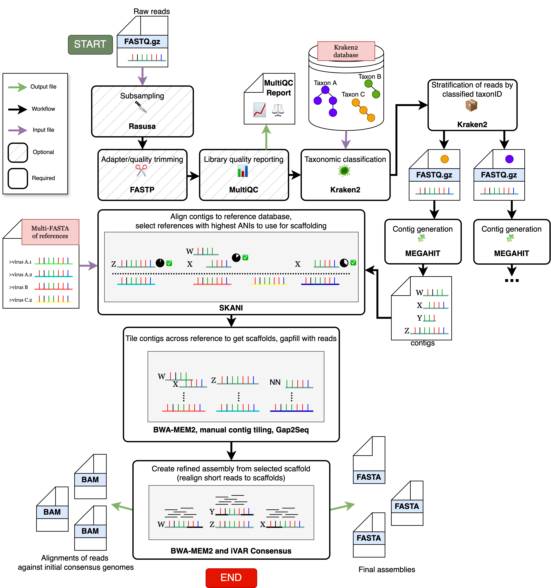

<p align="center">



</p>


## 📖 About
DeViRA is a pipeline for reference-guided denovo assembly of viral genomes from short-read sequencing data, tested with both shotgun and amplicon sequencing approaches. It is inspired by the Broad Institute's `assemble_denovo` workflow.

Right now, DeViRA is intended primarily for assembly of respiratory viruses, including:

- Seasonal coronaviruses
- Parainfluenza
- SARS-CoV2
- Influenzas A and B
- Enteroviruses (including rhinoviruses)
## 🔃 Workflow
1. DeViRA takes in raw FASTQ files specified in a user-created samplesheet, performs read trimming and QC reporting, and assigns reads to specific taxon bins with [kraken2](https://github.com/DerrickWood/kraken2). 

2. The reads associated with each bin are then assembled into contigs with [megahit](https://github.com/voutcn/megahit), and the contigs are compared to FASTA references in a user-supplied database; for all references above average nucleotide identity and coverage thresholds, DeViRA will use the references to guide and refine contig arrangement into scaffolds. 

3. Scaffold gaps undergo gap-filling with 1) sequencing reads and, if any gaps are left, 2) reference sequence. 

4. To generate a consensus genome, sequencing reads are realigned to the scaffolds with [bwa-mem2](https://github.com/bwa-mem2/bwa-mem2), and the alignment is used to call consensus with [ivar consensus](https://github.com/andersen-lab/ivar). This is performed twice to get longer assemblies with less bias towards the chosen reference genome.

## 💾 Installation

1. download the latest `devira` file from the "Releases page" or run this command:
    ```
    wget https://raw.githubusercontent.com/epiliper/devira/refs/heads/main/devira
    ```
    It's recommended that you move this file somewhere to your $PATH to run it from anywhere.

2. Install [Docker](https://docs.docker.com/desktop/) if you haven't already
3. Install [Nextflow](https://www.nextflow.io/docs/latest/install.html) if you haven't already

## 🦠 Instructions
1. Ensure the Docker desktop client is running.

2. Arrange all input fastqs (can be plain .fastq or compressed .fastq.gz) in their own directory.

##### 🚨 <span style="color: red;">MANDATORY: </span>all fastq files must have unique sample names before the first underscore ('_') character.
RIGHT: ```sample1_R1.fastq.gz sample1_R2.fastq.gz```  
WRONG: ```sample_1_R1.fastq.gz sample_2_R1.fastq.gz```  

- In the wrong case, sample_1_R1 would get wrongly paired with sample_2_R1.
- *It's recommended to have the read mate info (e.g. R1, 1) immediately follow the first underscore, after the unique sample name.*
- if samples do not have underscores, this logic applies to the period ('.') character instead.

3. once you're sure your fastqs are correctly named, run:

```
devira <fastq_dir> -profile docker --output <out_dir>
```

For a description of all options, run `devira -h`.

4. Once the pipeline is done, consensus genomes can be found in `$out_dir/final_files/final_assemblies`. For reports of any genomes/samples that failed assembly QC thresholds, see files in `$out_dir/fail`.

You can test this with out with the pipeline's example data, located in `fastq_example`.

## 🤓 For developers

### Running the pipeline with advanced nextflow options

The `devira` script is just a wrapper over the basic `nextflow run` command; it creates a fastq samplesheet from given input directory, and passes other arguments to nextflow itself. You can pass any of the typical nextflow arguments to the `devira` script. This includes the `-c` command to specify advanced options for, as an example, running the pipeline on AWS Batch or other cloud computing environments.

### Kraken2 database
After trimmed reads are classified with Kraken2 early in the pipeline, reads associated with a specific taxon are extracted into a new file, and this is repeated for all taxon IDs listed in a TSV file input to the pipeline. The default taxon ID list can be found in `assets/taxids.tsv`. Reads not related to any of the taxon IDs in the list, or unclassified reads period, are not used in downstream assembly. 

> [!IMPORTANT]   
> If you want to make your own ID list, it's recommended to keep taxon IDs at species-level or higher, to avoid over-stratification of reads and lots of unnecessary file/generation processing.

The kraken2 database we use is generated solely from the fasta sequences in `assets/ref.fa`. To add your own sequences, you'll have to recreate the database. See [our instructions for how to do so](creating_kraken2_db.md). You can specify a path to your Kraken2 database with `--kraken2_db $DB`.

### Reference database
The reference database used for selecting sequences to guide scaffolding is the same as in our reference-based assembly pipeline, [revica-strm](https://github.com/greninger-lab/revica-strm). It's comprised of multiple representatives of a variety of respiratory virus species such as enterovirus, seasonal coronavirus, SARS-CoV2, parainfluenza, measles, influenza, and more. Inspect `assets/ref.fa` if curious. If you intend to use your own database, ensure the fasta headers are structured as follows:   

```ACCESSION<SPACE>REF_TAG<SPACE>SAMPLE_HEADER```   

where REF_TAG should be unique to a species-specific segment/genome. Take these entries for Flu A segments PB1 and NS1, and an enterovirus genome, for example:

```
>NC_007364.1 fluA_NS1 Influenza A virus (A/goose/Guangdong/1/1996(H5N1)) segment 8, complete sequence
>NC_007375.1 fluA_PB1 Influenza A virus (A/Korea/426/1968(H2N2)) segment 2, complete sequence
>AF406813.1 EV Porcine enterovirus 8 strain V13, complete genome
```
You can specify your own reference database with `--refs $REF_DB`.

